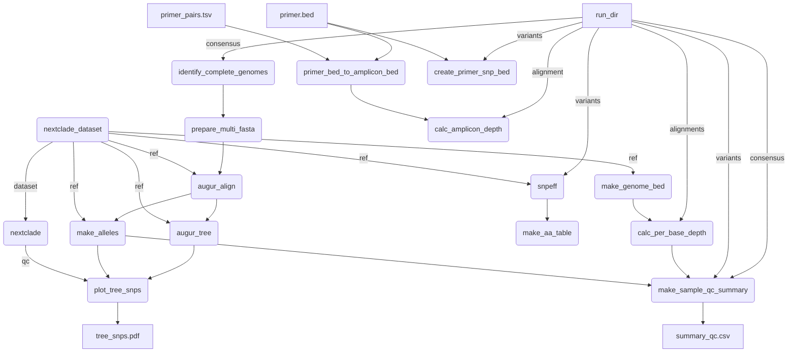

# mpxv-qc

A companion pipeline to [BCCDC-PHL/mpxv-artic-nf](https://github.com/BCCDC-PHL/mpxv-artic-nf) for quality-control analysis.
This pipeline is based directly on [jts/ncov-tools](https://github.com/jts/ncov-tools), with some adjustments made for monkeypox virus analysis.



## Usage
This pipeline makes some assumptions about the directory structure of the input dataset. We assume that there is a directory below the directory passed via the `--run_dir` flag, named like: `mpxv-artic-nf-vX.Y-output`, which contains output from the [BCCDC-PHL/mpxv-artic-nf](https://github.com/BCCDC-PHL/mpxv-artic-nf) pipeline.

```
nextflow run BCCDC-PHL/mpxv-qc \
  -profile conda \
  --cache ~/.conda/envs \
  --run_dir </path/to/run_dir> \
  --bed </path/to/mpxv.scheme.bed> \
  --primer_pairs_tsv </path/to/primer_pairs.tsv> \
  --outdir <output_dir>
```

## Parameters

| Name                          | Default | Description                                                                                      |
|:------------------------------|--------:|:-------------------------------------------------------------------------------------------------|
| `minimum_genome_completeness` | `85.0`  | Genome completeness threshold below which samples will be excluded from tree/SNPs plot.          |
| `partial_genome_threshold`    | `85.0`  | Genome completeness threshold below which samples will be tagged as `PARITAL_GENOME`             |
| `incomplete_genome_threshold` | `50.0`  | Genome completeness threshold below which samples will be tagged as `INCOMPLETE_GENOME`          |
| `excess_ambiguity_threshold`  | `5`     | Number of ambiguous bases in consensus above which samples will be tagged as `EXCESS_AMBIGUITY`  |

